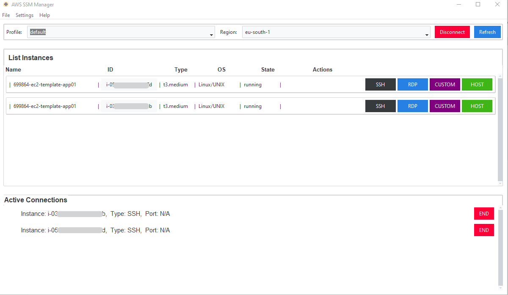

# AWS SSM MANAGER

## Description

AWS Systems Manager (SSM) Manager is a powerful application designed to simplify the management of your AWS resources. With AWS SSM Manager, you have a GUI to connect your EC2 with secure tunnel.

## Features

- **Feature 1:** Description of feature 1.
- **Feature 2:** Description of feature 2.
- **Feature 3:** Description of feature 3.

## Installation and Requirements

### Requirements
- Windows 10, Windows 11
- AWS CLI installed
- AWS SSM plugin installed

### Installation
- Download Setup [Setup](https://github.com/mauroo82/ssm-manager/blob/main/installer/setup.exe).

## Usage

## Contributing

## License

## Contact

For more information, you can reach me at Linkedin profile https://www.linkedin.com/in/mauro-arduini-0aa86621/
