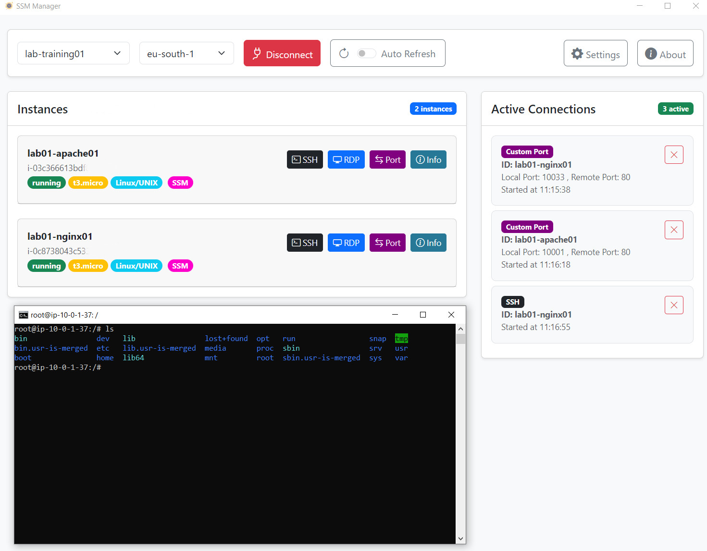

# SSM Manager (AWS)
A desktop application for managing SSM sessions on AWS cloud with a user-friendly GUI interface.



  - [Description](#description)
  - [Features](#features)
    - [Core Functionality](#core-functionality)
    - [Instance Management](#instance-management)
    - [Connection Types](#connection-types)
    - [Active Connection Management](#active-connection-management)
    - [UI & Usability](#ui--usability)
    - [Additional Features](#additional-features)
  - [Requirements](#Requirements)
  - [Installation](#installation)
  - [Windows Security Warning](#windows-security-warning)
  - [Usage](#usage)
  - [Development](#development)
    - [Requirements](#requirements)
    - [Setup Development Environment](#setup-development-environment)
    - [Building from Source](#building-from-source)
  - [Contributing](#contributing)
  - [Bug reports](#bug-reports)
  - [License](#license)
  - [Acknowledgments](#acknowledgments)
  - [Support](#support)


## Description

SSM Manager is a Windows desktop application that provides a graphical interface for managing AWS Systems Manager sessions. It simplifies the process of connecting to EC2 instances through AWS Systems Manager by providing an intuitive interface for SSH sessions, RDP connections, custom port forwarding, and host port forwarding.

## Features

### Core Functionality
- **Profile and Region Management**
  - Easy switching between AWS profiles
  - Region selection with persistence across sessions
  - Connection status monitoring (account ID shown on connect)
  - Support for AWS SSO, role_arn and Leapp profiles (reads both `~/.aws/credentials` and `~/.aws/config`)
  - Refresh AWS profiles without restarting the app

### Instance Management
- **Compact instance list** — each row shows the VM name and action buttons; click the chevron to expand full details
- **Expanded card** shows: instance ID, OS, VM type, state, SSM status badges, and any active connections on that instance
- **Instance counters** — total, Linux, Windows, SSM-enabled, and active connections; click a counter to filter the list, click again to reset
- **Real-time search** by instance ID — filters instantly as you type
- **Pagination** — 20 instances per page; navigation appears automatically when more than 20 instances are present
- Paginated AWS API calls — supports environments with more than 50 SSM instances
- **Connection indicator** — a small amber icon appears next to the action buttons whenever that instance has at least one active connection

### Connection Types
- **SSH Sessions**
  - Direct SSH connection to instances via SSM
  - Session monitoring and automatic cleanup when the terminal window closes

- **RDP Connections**
  - Automated RDP port forwarding setup
  - Integration with Windows Remote Desktop (`mstsc`)
  - Dynamic local port allocation

- **Port Forwarding**
  - User-defined local port forwarding (instance port)
  - Remote host port forwarding through an instance (remote host + port)
  - Dynamic local port assignment
  - One-click `localhost:<port>` link for HTTP/HTTPS tunnels

### Active Connection Management
- Active connections displayed inline inside the expanded instance card
- Each connection shows: type badge (SSH = black, RDP = blue, custom = purple), start timestamp, local and remote port details
- One-click terminate button per connection
- Active connection count badge in the instance list header

### UI & Usability
- **Dark mode** toggle in Settings, persisted across sessions
- **Modern design system** — brand header with orange accent, rounded cards, smooth transitions
- Instance cards have a colored left border: black for Linux, blue for Windows
- Instance counter badges are semi-transparent by default; highlight on hover; show a focus ring when a filter is active
- Search box with rounded pill style, gray background, and instant filtering

### Additional Features
- App version shown in the About modal with a link to release notes
- Logging system with configurable log level (in Settings)
- Last used profile and region restored on next launch

## Requirements

- Windows 10 / 11
- AWS CLI installed and configured [[instructions here](https://docs.aws.amazon.com/cli/latest/userguide/getting-started-install.html)]
- AWS SSM Plugin for AWS CLI installed [[instructions here](https://docs.aws.amazon.com/systems-manager/latest/userguide/session-manager-working-with-install-plugin.html)]
- Valid AWS credentials configured, or Leapp installed and configured [[instructions here](https://github.com/Noovolari/leapp)]

## Installation

1. Download the latest release from the releases page [**HERE**](https://github.com/mauroo82/ssm-manager/releases/latest).
2. Run the installer `SSM-Manager-vX.Y-setup.exe`.
3. If Windows SmartScreen shows a security warning, see the [Windows Security Warning](#windows-security-warning) section below.
4. Ensure that AWS CLI and SSM Plugin are installed:
   ```bash
   aws --version
   aws ssm start-session --version
   ```
5. Choose one of the following methods to configure AWS access:
   - **Option A**: Configure AWS CLI and log in to AWS. [**Instructions here**](https://docs.aws.amazon.com/cli/latest/userguide/getting-started-install.html)
   - **Option B**: Install and configure Leapp, then log in to AWS. [**Instructions here**](https://github.com/Noovolari/leapp)
6. Launch **SSM Manager**.
7. The SSM Agent must be installed on your EC2 instances for all features to work.
8. Verify proper IAM permissions for SSM sessions.


## Windows Security Warning

> 🇬🇧 **English**
>
> When running the installer for the first time, Windows SmartScreen may display a warning:
> **"Windows protected your PC"**.
> This happens because the application is not yet signed with a commercial code-signing certificate.
> The application is fully open source — you can review the complete source code in this repository.
>
> **To proceed:**
> 1. Click **"More info"** in the warning dialog.
> 2. Click **"Run anyway"**.
>
> The installer will then proceed normally.

---

> 🇮🇹 **Italiano**
>
> Al primo avvio dell'installer, Windows SmartScreen potrebbe mostrare un avviso:
> **"Il PC è stato protetto da Windows"**.
> Questo accade perché l'applicazione non è ancora firmata con un certificato di firma del codice commerciale.
> L'applicazione è completamente open source — puoi verificare l'intero codice sorgente in questo repository.
>
> **Per procedere:**
> 1. Clicca su **"Ulteriori informazioni"** nella finestra di avviso.
> 2. Clicca su **"Esegui comunque"**.
>
> L'installer procederà normalmente.

---

## Usage

1. Launch the application.
2. Select your AWS profile and region, then click **Connect**.
3. The instance list loads automatically. Use the counter badges or the search box to filter.
4. Click the **chevron** on any instance row to expand its details and see active connections.
5. Use the action buttons to establish connections:
   - **SSH** — opens a terminal session via SSM
   - **RDP** — sets up port forwarding and launches Windows Remote Desktop
   - **PORT** — custom port forwarding (instance port or remote host:port)

## Development

### Requirements
- Python 3.12+
- See `requirements.txt` for the full dependency list

### Setup Development Environment
```bash
git clone https://github.com/mauroo82/ssm-manager.git
cd ssm-manager
pip install -r requirements.txt
python app.py
```

### Building from Source

Requirements: Python 3.12+, [Inno Setup 6](https://jrsoftware.org/isdl.php) installed.

```powershell
# Activate the virtual environment
.venv\Scripts\activate

# Run the build script (cleans previous output, builds exe + installer)
.\build.ps1
```

The script will:
1. Clean `build/`, `dist/` and `installer/` folders
2. Run PyInstaller to produce `dist\SSM Manager\`
3. Run Inno Setup to produce `installer\SSM-Manager-vX.Y-setup.exe`

> **Note:** The build requires `--collect-all pythonnet` and `--collect-all clr_loader` flags.
> Without these, pywebview crashes at startup on Windows. These flags are already included in `build.ps1`.

## Contributing

Contributions are welcome! Please feel free to submit a Pull Request. For major changes, please open an issue first to discuss what you would like to change.

## Bug reports

Create an issue on GitHub. Please include:
- Steps to reproduce the bug
- The `app.log` file
- The version of SSM Manager
- Your Windows version

## License

MIT License
Copyright (c) 2024

Permission is hereby granted, free of charge, to any person obtaining a copy
of this software and associated documentation files (the "Software"), to deal
in the Software without restriction, including without limitation the rights
to use, copy, modify, merge, publish, distribute, sublicense, and/or sell
copies of the Software, and to permit persons to whom the Software is
furnished to do so, subject to the following conditions:
The above copyright notice and this permission notice shall be included in all
copies or substantial portions of the Software.
THE SOFTWARE IS PROVIDED "AS IS", WITHOUT WARRANTY OF ANY KIND, EXPRESS OR
IMPLIED, INCLUDING BUT NOT LIMITED TO THE WARRANTIES OF MERCHANTABILITY,
FITNESS FOR A PARTICULAR PURPOSE AND NONINFRINGEMENT. IN NO EVENT SHALL THE
AUTHORS OR COPYRIGHT HOLDERS BE LIABLE FOR ANY CLAIM, DAMAGES OR OTHER
LIABILITY, WHETHER IN AN ACTION OF CONTRACT, TORT OR OTHERWISE, ARISING FROM,
OUT OF OR IN CONNECTION WITH THE SOFTWARE OR THE USE OR OTHER DEALINGS IN THE
SOFTWARE.

## Acknowledgments

- All contributors who helped improve this tool

## Support

If you encounter any problems or have suggestions, please open an issue in the GitHub repository.
