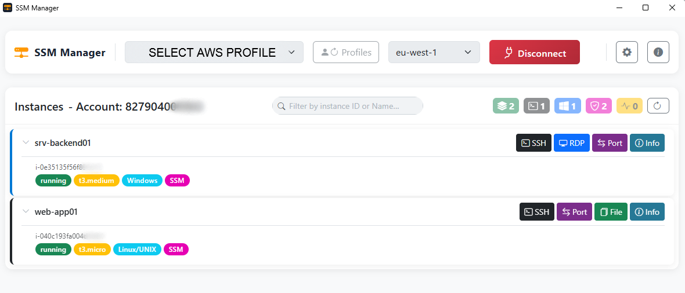

<div align="center">



# SSM Manager

**A fast, clean Windows desktop GUI for AWS Systems Manager sessions.**

No terminal juggling. No forgotten flags. Just click and connect.

<p align="center">
  <a href="https://github.com/mauroo82/ssm-manager/releases/latest">
    
  </a>
  <a href="https://github.com/mauroo82/ssm-manager/releases/latest">
    
  </a>
  <a href="https://github.com/mauroo82/ssm-manager/blob/main/LICENSE">
    
  </a>
  <a href="https://github.com/mauroo82/ssm-manager/stargazers">
    
  </a>
</p>

<p align="center">
  <a href="https://ssm-manager.net/">🌐 Website</a> ·
  <a href="https://github.com/mauroo82/ssm-manager/releases/latest">⬇️ Download</a> ·
  <a href="https://github.com/mauroo82/ssm-manager/issues">🐛 Report a Bug</a> ·
  <a href="#-building-from-source">🔨 Build from Source</a>
</p>

</div>

---

<details open>
<summary><b>📋 Table of Contents</b></summary>

- [🚀 What is SSM Manager?](#-what-is-ssm-manager)
- [✨ Features](#-features)
- [⚙️ Requirements](#%EF%B8%8F-requirements)
- [📦 Installation](#-installation)
- [🛡️ Security & Trust](#%EF%B8%8F-security--trust)
- [📖 Usage](#-usage)
- [🔧 Making an EC2 Instance Available via AWS SSM](#-making-an-ec2-instance-available-via-aws-ssm)
- [🔨 Building from Source](#-building-from-source)
- [❤️ Support the Project](#️-support-the-project)
- [🤝 Contributing](#-contributing)
- [🐛 Bug Reports](#-bug-reports)
- [📄 License](#-license)

</details>

---

## 🚀 What is SSM Manager?

SSM Manager is a **Windows desktop application** that wraps AWS Systems Manager into a clean, intuitive GUI. No need to remember `aws ssm start-session` flags — pick your profile, pick your instance, click a button.

Under the hood it runs a local Flask server rendered inside a native window via **pywebview**, so it feels like a native app with zero browser overhead.

---

## ✨ Features

### 🔌 Connection Types

| Type | Description |
|------|-------------|
| **SSH** | Direct terminal session via SSM — opens a native `cmd.exe` window |
| **RDP** | Auto port-forward to 3389 + launches Windows Remote Desktop (`mstsc`) — *Windows instances only* |
| **Port Forwarding** | User-defined local port → instance port, or tunnel through the instance to a remote host:port |
| **File Transfer (SCP)** | Upload / download files over a temporary SSM SSH tunnel — *Linux instances only* |

### 🖥️ Instance Management

- **Compact list** — VM name + action buttons; click the chevron to expand full details
- **Expanded card** — instance ID, OS, VM type, state, SSM status badges, active connections
- **Counters** — total / Linux / Windows / SSM-enabled / active; click to filter, click again to reset
- **Real-time search** by instance ID or name
- **Pagination** — 20 instances per page, auto-appears when needed; supports environments with 50+ SSM instances
- **Connection indicator** — amber icon next to action buttons when an instance has active connections

### 🔐 Security Extras

- **Windows Administrator password decryption** — in the Info modal on Windows instances, paste your PEM private key to decrypt the Administrator password via RSA PKCS1v15; decryption is local, the key never leaves your machine
- Flask server bound to `127.0.0.1` only — never exposed to the network

### 🛠️ Usability

- **Auto update check** — on startup, the app silently checks GitHub for a newer release; a dismissible banner appears if one is found
- **Profile & region persistence** — last used settings restored on next launch
- **Refresh profiles** without restarting the app (supports AWS SSO, role_arn, Leapp)
- **Dark mode** toggle in Settings, persisted across sessions
- **Active connection management** — inline per instance card; one-click terminate
- Configurable log level at runtime (Settings)
- App version + release notes link in the About modal

---

## ⚙️ Requirements

| Requirement | Notes |
|-------------|-------|
| **Windows 10 / 11** | The only supported platform for now |
| **AWS CLI** | [Install guide](https://docs.aws.amazon.com/cli/latest/userguide/getting-started-install.html) |
| **Session Manager Plugin** | [Install guide](https://docs.aws.amazon.com/systems-manager/latest/userguide/session-manager-working-with-install-plugin.html) |
| **AWS credentials** | Via AWS CLI, SSO, or [Leapp](https://github.com/Noovolari/leapp) |
| **SSM Agent on EC2** | Must be installed and running on target instances |

---

## 📦 Installation

1. **[Download the latest installer](https://github.com/mauroo82/ssm-manager/releases/latest)** — `SSM-Manager-vX.Y-setup.exe`
2. Run the installer. If Windows SmartScreen shows a warning, see [Security & Trust](#%EF%B8%8F-security--trust) below.
3. Verify AWS CLI and the SSM plugin are available:
   ```powershell
   aws --version
   aws ssm start-session --version
   ```
4. Configure AWS credentials (Option A: AWS CLI · Option B: Leapp)
5. Launch **SSM Manager**, select profile + region, click **Connect**.

---

## 🛡️ Security & Trust

### Why is the installer not signed?

Code-signing certificates (EV, trusted by SmartScreen) cost hundreds of euros per year. To keep SSM Manager **100% free and open-source**, there is no certificate — for now.

Here are **four ways to verify the installer before running it**:

#### 1 · Verify the SHA-256 checksum

Every release ships a `checksums.txt` file alongside the installer. Compare the hash:

```powershell
# PowerShell
(Get-FileHash 'SSM-Manager-vX.Y-setup.exe' -Algorithm SHA256).Hash.ToLower()
# Must match the hash in checksums.txt
```
```bash
# bash / WSL
sha256sum SSM-Manager-vX.Y-setup.exe
```

#### 2 · Scan with VirusTotal

Upload the installer to **[virustotal.com](https://www.virustotal.com)** — it's free, requires no account, and runs the file against 70+ antivirus engines simultaneously. Seeing *"0/70 engines detected this file"* is the best reassurance for a security-conscious sysadmin.

#### 3 · Build from source

The full build takes under 5 minutes. See [Building from Source](#-building-from-source) below — you get a binary you compiled yourself.

#### 4 · Read the source code

Every line is open and auditable in this repository.

---

### Windows SmartScreen warning

> 🇬🇧 When running the installer for the first time, Windows SmartScreen may show:
> **"Windows protected your PC"** — because the app is not yet code-signed.
>
> **To proceed:** click **More info** → **Run anyway**.

> 🇮🇹 Al primo avvio dell'installer, SmartScreen potrebbe mostrare:
> **"Il PC è stato protetto da Windows"**.
>
> **Per procedere:** clicca **Ulteriori informazioni** → **Esegui comunque**.

---

## 📖 Usage

1. Launch the application.
2. Select your **AWS profile** and **region**, then click **Connect**.
3. The instance list loads automatically. Use the **counter badges** or the **search box** to filter.
4. Click the **chevron** on any instance row to expand its details and see active connections.
5. Use the action buttons:

| Button | Action |
|--------|--------|
| **SSH** | Opens a terminal session via SSM |
| **RDP** | Sets up port forwarding and launches Remote Desktop *(Windows instances only)* |
| **Port** | Custom port forwarding (instance port or remote host:port) |
| **File** | Upload/download files via SCP tunnel *(Linux instances only)* |

> [!TIP]
> Click any value in the **Info modal** to copy it to the clipboard.
> On Windows instances, the Info modal also lets you decrypt the Administrator password using your PEM private key.

---

## 🔧 Making an EC2 Instance Available via AWS SSM

Before SSM Manager can connect to an EC2 instance, three conditions must be met: the SSM Agent must be running on the instance, the instance must have outbound network access to AWS endpoints, and it must carry an IAM role with the right permissions.

### 1 · SSM Agent

The SSM Agent is the software that runs on the instance and communicates with the AWS Systems Manager service.

**Pre-installed on these AMIs** (no action needed):
- Amazon Linux 2 / Amazon Linux 2023
- Ubuntu 16.04+ (AWS-published images)
- Windows Server 2008 R2 and later (AWS-published images)

**Must be installed manually** on:
- RHEL, CentOS, SUSE, Debian, and any custom/community AMI

Official installation guides:
- [Install SSM Agent on Linux](https://docs.aws.amazon.com/systems-manager/latest/userguide/sysman-install-ssm-agent.html)
- [Install SSM Agent on Windows](https://docs.aws.amazon.com/systems-manager/latest/userguide/sysman-install-win.html)

Verify the agent is running:
```bash
# Amazon Linux / RHEL / Ubuntu
sudo systemctl status amazon-ssm-agent
```
```powershell
# Windows
Get-Service AmazonSSMAgent
```

---

### 2 · Outbound Network Access

The SSM Agent must be able to reach the AWS Systems Manager service endpoints. Two options:

**Option A — Internet Gateway (simplest)**
The instance is in a public subnet, or in a private subnet with a NAT Gateway that routes outbound traffic to the internet. No additional configuration needed.

**Option B — VPC Endpoints (private subnet, no internet)**
Create Interface VPC Endpoints for the following services in the instance's VPC:

| Endpoint | Required |
|----------|----------|
| `com.amazonaws.<region>.ssm` | ✅ |
| `com.amazonaws.<region>.ssmmessages` | ✅ |
| `com.amazonaws.<region>.ec2messages` | ✅ |
| `com.amazonaws.<region>.s3` | Optional (for S3-backed session logging) |

> [!NOTE]
> The instance does **not** need a public IP address when using VPC endpoints.

Official reference: [Setting up VPC endpoints for Systems Manager](https://docs.aws.amazon.com/systems-manager/latest/userguide/setup-create-vpc.html)

---

### 3 · IAM Role & Policy

The instance must have an IAM **instance profile** (an IAM role attached to the EC2 instance) with at least the following AWS managed policy:

| Policy | ARN |
|--------|-----|
| `AmazonSSMManagedInstanceCore` | `arn:aws:iam::aws:policy/AmazonSSMManagedInstanceCore` |

**How to attach it:**
1. [IAM Console](https://console.aws.amazon.com/iam/) → **Roles** → **Create role** → Trusted entity: *EC2*
2. Attach the policy `AmazonSSMManagedInstanceCore`
3. Name the role (e.g. `EC2-SSM-Role`) and create it
4. [EC2 Console](https://console.aws.amazon.com/ec2/) → select your instance → **Actions → Security → Modify IAM role** → select the role

> [!TIP]
> If the instance was already running before the role was attached, the SSM Agent picks up the new credentials automatically within a few minutes — no reboot required.

Official reference: [Create an IAM instance profile for Systems Manager](https://docs.aws.amazon.com/systems-manager/latest/userguide/setup-instance-profile.html)

---

### ✅ Verification

Once all three conditions are met, the instance appears in SSM Manager's list within 1–2 minutes. You can also verify from the CLI:

```bash
aws ssm describe-instance-information \
  --query "InstanceInformationList[*].[InstanceId,PingStatus,PlatformName]" \
  --output table
```

A `PingStatus` of `Online` means the instance is ready to connect.

Official reference: [Verify SSM Agent connectivity](https://docs.aws.amazon.com/systems-manager/latest/userguide/ssm-agent-status-and-restart.html)

---

## 🔨 Building from Source

> [!NOTE]
> Don't want to trust a pre-built binary? Build it yourself in under 5 minutes — you get a binary you compiled from code you can read.

**Prerequisites:** Python 3.12+, [Inno Setup 6](https://jrsoftware.org/isdl.php)

```powershell
# 1. Clone the repo
git clone https://github.com/mauroo82/ssm-manager.git
cd ssm-manager

# 2. Create and activate a virtual environment
python -m venv .venv
.venv\Scripts\activate

# 3. Install dependencies
pip install -r requirements.txt

# 4. Build exe + installer (also generates checksums.txt automatically)
.\build.ps1
```

The script:
1. Cleans `build/`, `dist/`, `installer/`
2. Runs **PyInstaller** → `dist\SSM Manager\`
3. Runs **Inno Setup** → `installer\SSM-Manager-vX.Y-setup.exe`
4. Generates `installer\checksums.txt` with the SHA-256 hash

> [!IMPORTANT]
> The build requires `--collect-all pythonnet` and `--collect-all clr_loader` flags.
> Without these, pywebview crashes at startup on Windows. Both flags are already set in `build.ps1`.

---

## ❤️ Support the Project

If SSM Manager has saved you time and made your AWS workflow easier, consider supporting its development:

<p align="center">
  <a href="https://www.buymeacoffee.com/ssmmanager">
    
  </a>
  &nbsp;
  <a href="https://www.paypal.me/mauroarduini82">
    
  </a>
</p>

Every contribution — however small — helps keep the project alive and free.

---

## 🤝 Contributing

Contributions are welcome. For major changes, open an issue first to discuss the approach. For small fixes, a pull request is fine directly.

---

## 🐛 Bug Reports

Open an issue on GitHub and include:

- Steps to reproduce
- The `app.log` file (found in the install directory)
- SSM Manager version
- Windows version

---

## 📄 License

MIT License — Copyright © 2024 Mauro Arduini

Permission is hereby granted, free of charge, to any person obtaining a copy of this software and associated documentation files (the "Software"), to deal in the Software without restriction, including without limitation the rights to use, copy, modify, merge, publish, distribute, sublicense, and/or sell copies of the Software, and to permit persons to whom the Software is furnished to do so, subject to the following conditions: The above copyright notice and this permission notice shall be included in all copies or substantial portions of the Software. THE SOFTWARE IS PROVIDED "AS IS", WITHOUT WARRANTY OF ANY KIND, EXPRESS OR IMPLIED, INCLUDING BUT NOT LIMITED TO THE WARRANTIES OF MERCHANTABILITY, FITNESS FOR A PARTICULAR PURPOSE AND NONINFRINGEMENT.

---

<div align="center">

Built with ☕ by [Mauro Arduini](https://www.linkedin.com/in/mauro-arduini-0aa86621/) · [ssm-manager.net](https://ssm-manager.net/) · [GitHub](https://github.com/mauroo82/ssm-manager)

⭐ If SSM Manager saves you time, a star on GitHub goes a long way!

</div>
